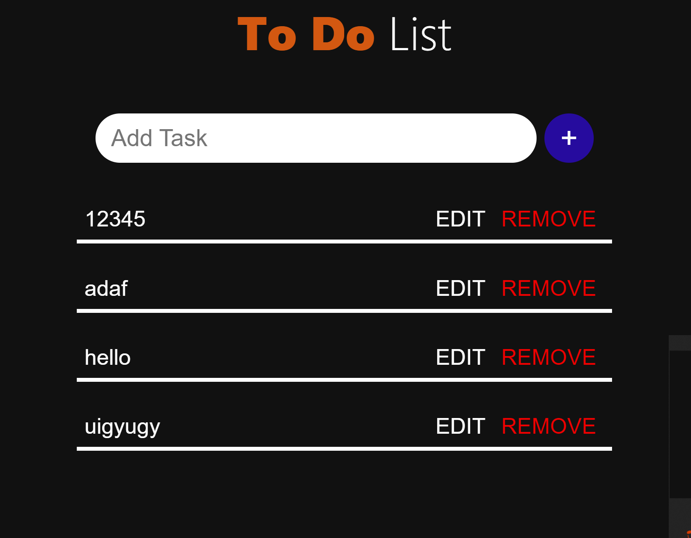

# node-mongodb-todo

Part 1 of the <a href="https://codedamn.com/learn/node-mongodb-fundamentals">Learn MongoDB with Node.js</a> course from Codedamn. In this part a simple To Do app is created using Express.

The installation and connection to a MongoDB database was the main issue address. A schema for this database was created using Mongoose.

Additionally, a CRUD model was created to enable conversation between the frontend part of the application and the database.

The pictures below depict the final working example:

  </img>
  </img>

